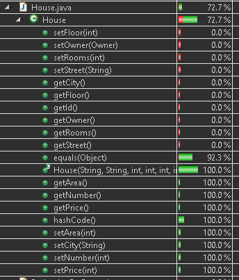

In this file are presented the coverages that junit tests achieved:
------

1. EvaluationForHouse Class:

2. EvaluationForRenter Class:

3. Lease Class:      

4. Request Class:      

5. House Class:

6. Owner Class:

7. Renter Class:

