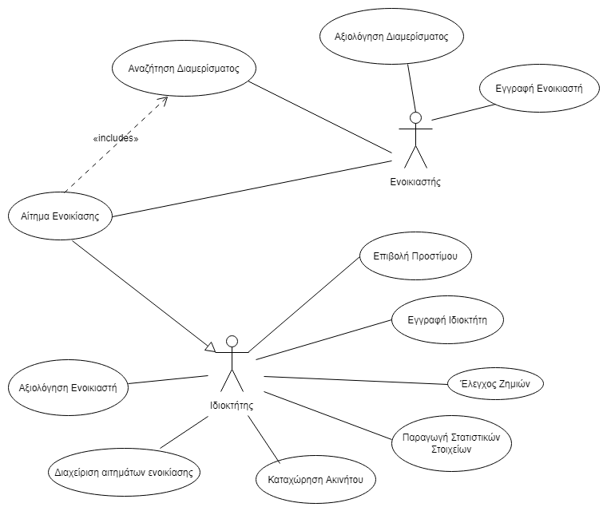

Η εφαρμογή θα διαχειρίζεται ενοικίαση διαμερισμάτων-σπιτιών σε μακροχρόνια και βραχυχρόνια περίοδο. Κάθε διαμέρισμα θα προσφέρει μια σειρά από προεπιλεγμένες υπηρεσίες.
Προϋπόθεση για χρήση των υπηρεσιών είναι η εγγραφή του υποψηφίου ενοικιαστή και του ιδιοκτήτη. Αφού καταχωρηθούν τα στοιχεία του ιδιοκτήτη, του δίνεται η δυνατότητα να καταχωρήσει στο σύστημα ένα ακίνητο. Τα διαμερίσματα μπορούν να αναζητούνται βάσει συγκεκριμένων κριτηρίων, όπως τετραγωνικά, περιοχή κλπ.
 Όταν ένας ενδιαφερόμενος ενοικιαστής επιλέξει ένα ακίνητο προς ενοικίαση θα πρέπει να καταχωρήσει σε μια φόρμα τα στοιχεία του και το διάστημα που θα χρειαστεί το ακίνητο .
Αφού ο ιδιοκτήτης λάβει το αίτημα ενοικίασης, μπορεί να εγκρίνει ή να απορρίψει το αίτημα ενοικίασης βάσει του προφίλ του υποψήφιου ενοικιαστή.
Κατόπιν της παράδοσης των κλειδιών του ακινήτου, ο χρήστης θα έχει τη δυνατότητα να συμπληρώσει μια φόρμα αξιολόγησης. Την ίδια δυνατότητα θα έχει και ο ιδιοκτήτης αναφορικά με τον ενοικιαστή.

Το σύστημα επίσης θα διαχειρίζεται πιθανή επιβολή προστίμου σε συμφωνία με τον ιδιοκτήτη του ακινήτου για τυχόν βλάβες, φθορές ή καταστροφές στο ακίνητο. Οι ζημιές θα αξιολογούνται σύμφωνα με προδιαγεγραμμένο πίνακα αξιολογήσεων που θα υπάρχει στο σύστημα και θα προστίθενται στο τελικό κόστος. 

Το σύστημα θα διατηρεί μια βάση δεδομένων με όλα τα απαραίτητα στοιχεία των ενοικιαστών, καθώς και μια με όλα τα στοιχεία των ακινήτων. 

Το σύστημα θα παράγει στατιστικά στοιχεία προς τους ιδιοκτήτες όπως μέση πληρότητα διαμερισμάτων ανά μήνα, έσοδα ανά μήνα και ανά διαμέρισμα, ακυρώσεις ανά μήνα.

 Παρακάτω υπάρχει το διάγραμμα περιπτώσεων χρήσης :
 
 
 
 

