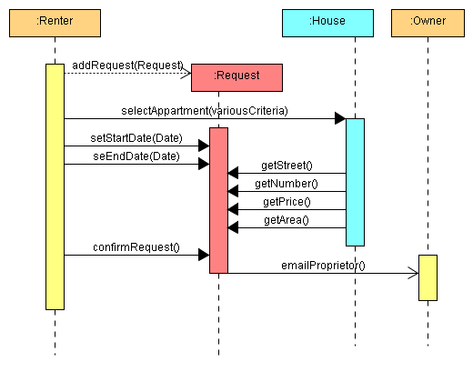
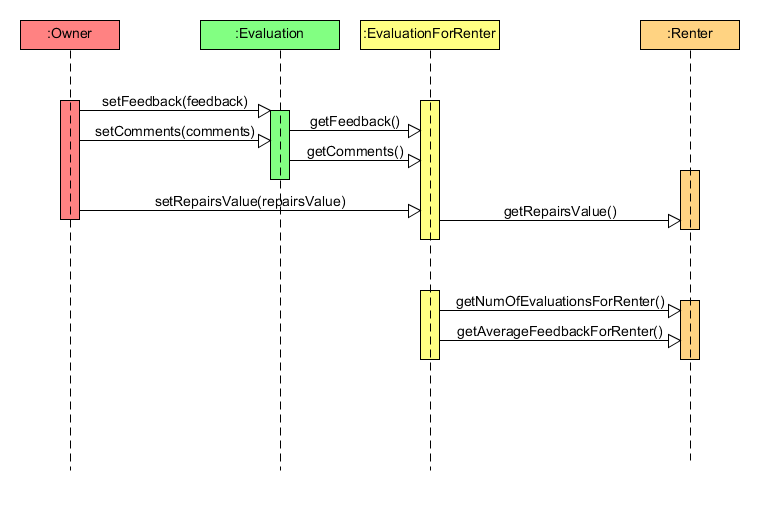
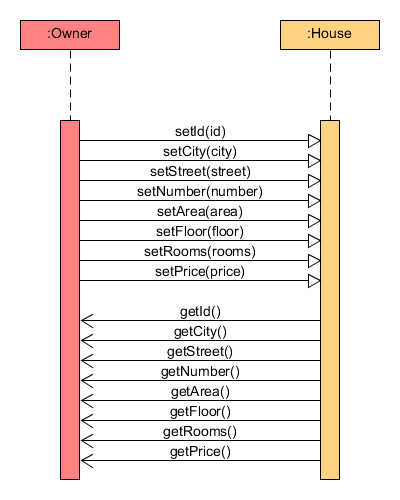

In this file are presented the coverages that junit tests achieved:
------

1. Sequence on UC4 (Request for Rent):

2. Sequence on UC4 (Evaluation of Renter):

3. Sequence on UC4 (Registering of House):      

