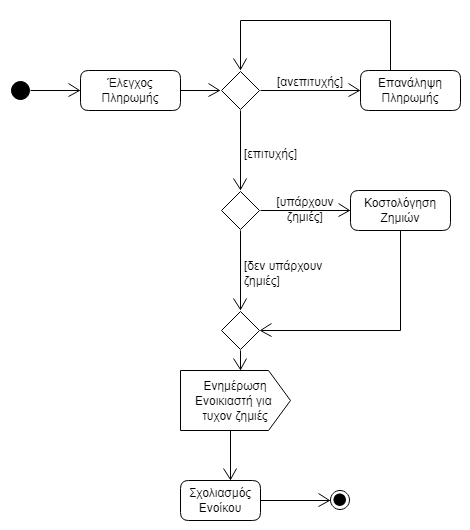
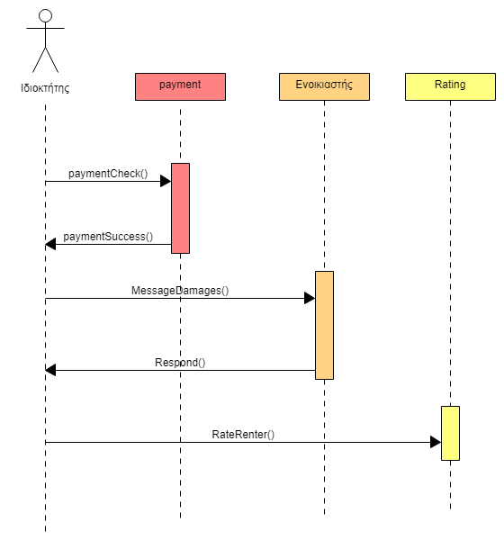
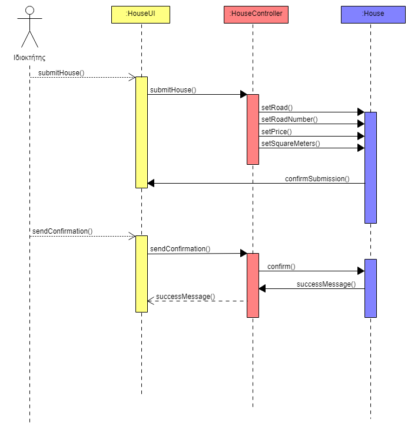

**1α. Εγγραφή Ενοικιαστή:**
---
#### Πρωτεύων Δράστης:
  Ενοικιαστής
#### Ενδιαφερόμενος:
  Ενοικιαστής: Απαραίτητη ενέργεια προκειμένου να τρέξει οποιαδήποτε άλλη περίπτωση χρήσης.
#### Προϋποθέσεις:
  Ο Ενοικιαστής διαθέτει σύνδεση στο διαδίκτυο, και ο browser που χρησιμοποιεί του επιτρέπει πρόσβαση στην ιστοσελίδα της εφαρμογής μας.
  
#### *Βασική ροή:*
  1. Ο ενοικιαστής, βρισκόμενος στην αρχική σελίδα του ιστοτόπου της εφαρμογής μας, επιλέγει να εγγραφεί.
  2. Το σύστημα εμφανίζει μια σχετική φόρμα εγγραφής, με κενά τα υπό συμπλήρωση πεδία.
  3. Ο ενοικιαστής συμπληρώνει τα στοιχεία του στα πεδία, στοιχεία όπως όνομα, επώνυμο, username, password κλπ.
  4. Το σύστημα ζητάει επιβεβαίωση για τον κωδικό (επαναπληκτρολόγηση), και πιθανώς κάποια επιπλέον αυθεντικοποίηση
    της ταυτότητας του ενοικιαστή μέσω της αποστολής ενός μηνύματος σε κάποιο δηλωθέντα λογαριασμό email.
  5. Το σύστημα καταχωρεί τα στοιχεία του ενοικιαστή στη βάση του, και ενημερώνει μέσω σχετικού μηνύματος τον ενοικιαστή.

#### *Εναλλακτικές ροές:*

3α. Ο ενοικιαστής παραλείπει να συμπληρώσει ορισμένα απαραίτητα πεδία. 
  1. Το σύστημα εμφανίζει σχετικό μήνυμα και αναμένει τη συμπλήρωση των σχετικών πεδίων.

4α. Ο ενοικιαστής εισάγει λανθασμένο κωδικό. 
  1. Το σύστημα εμφανίζει σχετικό μήνυμα και αναμένει εκ νέου τη συμπλήρωση του κωδικού.

**1β. Διαγραφή Χρήστη:**
---
#### Πρωτεύων Δράστης:
  Χρήστης
#### Ενδιαφερόμενος:
  Χρήστης: Απαραίτητη ενέργεια προκειμένου να κλείσει τον λογαριασμό του.
#### Προϋποθέσεις:
  Ο Χρήστης διαθέτει σύνδεση στο διαδίκτυο, ο browser που χρησιμοποιεί του επιτρέπει πρόσβαση στην ιστοσελίδα της εφαρμογής μας, και έχει ταυτοποιηθεί.
  
#### *Βασική ροή:*
  1. Ο Χρήστης, επιλέγει να διαγραφεί (σχετικό κουμπί).
  2. Το σύστημα εμφανίζει ένα επιβεβαιωτικό μήνυμα.
  3. Ο Χρήστης, επικυρώνει την ενέργειά του.
  4. Το σύστημα διαγράφει τα στοιχεία του Χρήστη από τη βάση του, και τον ενημερώνει μέσω σχετικού μηνύματος.

#### *Εναλλακτικές ροές:*

2α. Ο Χρήστης ακυρώνει τη διαδικασία. 
  1. Το σύστημα επιστρέφει στην αρχική σελίδα.

**1γ. Τροποποίηση Στοιχείων Χρήστη:**
---
#### Πρωτεύων Δράστης:
  Χρήστης
#### Ενδιαφερόμενος:
  Χρήστης: Απαραίτητη ενέργεια προκειμένου να τροποποιήσει τα στοιχεία του λογαριασμού του.
#### Προϋποθέσεις:
  Ο Χρήστης διαθέτει σύνδεση στο διαδίκτυο, ο browser που χρησιμοποιεί του επιτρέπει πρόσβαση στην ιστοσελίδα της εφαρμογής μας, και έχει ταυτοποιηθεί.
  
#### *Βασική ροή:*
  1. Ο Χρήστης, επιλέγει να τροποποιήσει τα στοιχεία του (σχετικό κουμπί).
  2. Το σύστημα εμφανίζει τα στοιχεία του, και επιτρέπει στον χρήστη να τα επαναπληκτρολογήσει.
  3. Ο Χρήστης αλλάζει ένα ή περισσότερα στοιχεία και επικυρώνει την ενέργειά του.
  4. Το σύστημα τροποποιεί τα στοιχεία του Χρήστη στη βάση του, και τον ενημερώνει μέσω σχετικού μηνύματος.

#### *Εναλλακτικές ροές:*

3α. Ο Χρήστης παραλείπει να συμπληρώσει ορισμένα απαραίτητα πεδία. 
  1. Το σύστημα εμφανίζει σχετικό μήνυμα και αναμένει τη συμπλήρωση των σχετικών πεδίων.
  
## 2. **Αξιολόγηση Διαμερίσματος**
#### Πρωτεύων Δράστης:
  Ενοικιαστής
#### Ενδιαφερόμενοι:
  Ενοικιαστής: Θέλει να μπορεί να αξιολογεί ένα διαμέρισμα, προκειμένου να διευκολύνει τον εαυτό του αλλά και άλλους χρήστες, όσο αφορά την αποφυγή διαμερισμάτων που δεν ανταποκρίνονται σε όσα αναφέρει ο ιδιοκτήτης του, αλλά και όσο αφορά τη προσθήκη πληροφοριών που δεν αναφέρονται από τον ιδιοκτήτη, ή θετικών σχολίων.
  
  Ιδιοκτήτης: Θέλει να λαμβάνει feedback όσο αφορά το διαμέρισμα του, προκειμένου να προβεί στις απαραίτητες ή υποδεικνυόμενες αλλαγές.
#### Προϋποθέσεις:
  Ο Ενοικιαστής έχει πληρώσει τη διαμονή του.
  
#### *Βασική ροή:*
  1. Ο ενοικιαστής, για να αξιολογήσει ένα διαμέρισμα, κάνει log-in στον ιστότοπο της εφαρμογής και μεταβαίνει σε μια σχετική                     σελίδα.
  2. Το σύστημα εμφανίζει μια φόρμα αξιολόγησης διαμερίσματος, με κενά τα υπό συμπλήρωση πεδία.
  3. Ο ενοικιαστής, συμπληρώνει τα στοιχεία, όπως το κατά πόσο ανταπεξέρχονταν στην πραγματικότητα οι διαφημιζόμενες υπηρεσίες, οι συνθήκες υγιεινής κλπ.
  4. Το σύστημα επεξεργάζεται κατάλληλα τα παραπάνω στοιχεία και τα καταχωρεί στη βάση του, και ενημερώνει μέσω σχετικού μηνύματος τον ενοικιαστή.
  
 #### *Εναλλακτικές ροές:*
  
  3α. Ο ενοικιαστής παραλείπει να συμπληρώσει ορισμένα απαραίτητα πεδία. 
  1. Το σύστημα εμφανίζει σχετικό μήνυμα και αναμένει τη συμπλήρωση των σχετικών πεδίων.

## 3. **Αναζήτηση Διαμερίσματος**
#### Πρωτεύων Δράστης:
  Ενοικιαστής
#### Ενδιαφερόμενος:
  Ενοικιαστής: Θέλει να μπορεί να αναζητεί ένα διαμέρισμα, προκειμένου να ενημερώνεται για τα υπάρχοντα διαμερίσματα που τον ενδιαφέρουν, βάσει της περιοχής, των τετραγωνικών κλπ, και στη συνέχεια να έχει τη δυνατότητα να επιλέξει κάποιο. (Βλέπε περίπτωση χρήσης "Αίτημα Ενοικίασης".)
#### Προϋποθέσεις:
  Ο Ενοικιαστής έχει εκτελέσει με επιτυχία την περίπτωση χρήσης "Εγγραφή Ενοικιαστή".
  
#### *Βασική ροή:*
  1. Ο ενοικιαστής, για να αναζητήσει ένα διαμέρισμα, κάνει log-in στον ιστότοπο της εφαρμογής και μεταβαίνει σε μια σχετική σελίδα.
  2. Το σύστημα εμφανίζει μια φόρμα αναζήτησης διαμερίσματος.
  3. Ο ενοικιαστής, συμπληρώνει τα κριτήρια της αναζήτησης, τα οποία είναι η περιοχή, η τιμή και τα τετραγωνικά
  4. Το σύστημα επεξεργάζεται κατάλληλα τα παραπάνω στοιχεία και εμφανίζει έπειτα από αναζήτηση στη βάση δεδομένων, τα συναφή με την αναζήτηση του ενοικιαστή διαμερίσματα.
  
#### *Εναλλακτικές ροές:*
  
  1α. Ο ενοικιαστής δεν έχει εγγραφεί στην εφαρμογή.
  1. Το σύστημα εμφανίζει μήνυμα σφάλματος, και ενημερώνει το χρήστη πως πρέπει να εγγραφεί.
  2. Ο χρήστης εγγράφεται στην εφαρμογή, όπως αναφέρεται στην ΠΧ Εγγραφή Ενοικιαστή.
    
## 4. **Αίτημα ενοικίασης**
#### Πρωτεύων Δράστης:
  Ενοικιαστής
#### Ενδιαφερόμενοι:
  Ενοικιαστής: Θέλει να μπορεί να επιλέξει ένα διαμέρισμα προς ενοικίαση, και να ενημερώσει τον ιδιοκτήτη του για αυτή του την ενέργεια.
  
  Ιδιοκτήτης: Θέλει να ενημερώνεται, και στη συνέχεια να εγκρίνει ή να απορρίπτει (Βλέπε περίπτωση χρήσης "Διαχείριση αιτημάτων ενοικίασης") τα υποβληθέντα αιτήματα ενοικίασης για τα διαμερίσματά του.
#### Προϋποθέσεις:
  Ο Ενοικιαστής έχει εκτελέσει με επιτυχία τις περιπτώσεις χρήσης "Εγγραφή Ενοικιαστή" και "Αναζήτηση Διαμερίσματος".
  
#### *Βασική ροή:*
  1. Ο ενοικιαστής, για να αποστείλει ένα αίτημα ενοικίασης διαμερίσματος, κάνει log-in στον ιστότοπο της εφαρμογής και μεταβαίνει σε μια σχετική σελίδα.
  2. Το σύστημα εμφανίζει τις παλαιότερες αναζητήσεις του χρήστη.
  3. Ο ενοικιαστής, μπορεί να επιλέξει ένα από τα διαμερίσματα που εντόπισε σε μία από τις παλαιότερες αναζητήσεις, ή να κάνει μια καινούργια αναζήτηση, όπως αναφέρεται στην ΠΧ Αναζήτηση Διαμερίσματος.
  4. Σε κάθε περίπτωση, ο ενοικιαστής επιλέγει ένα διαμέρισμα, και τις επιθυμητές ημερομηνίες κράτησης
  5. Το σύστημα εμφανίζει επιβεβαιωτικό μήνυμα προς τον ενοικιαστή.
  6. Ο ενοικιαστής επικυρώνει το παραπάνω.
  7. Το σύστημα ενημερώνει τον ιδιοκτήτη μέσω email πως το διαμέρισμά του έτυχε αιτήματος ενοικίασης.
  
#### *Εναλλακτικές ροές:*
  
  1α. Ο ενοικιαστής δεν έχει εγγραφεί στην εφαρμογή.  
  1. Το σύστημα εμφανίζει μήνυμα σφάλματος, και ενημερώνει το χρήστη πως πρέπει να εγγραφεί.
  2. Ο χρήστης εγγράφεται στην εφαρμογή, όπως αναφέρεται στην ΠΧ Εγγραφή Ενοικιαστή.
  
  2α. Ο ενοικιαστής δεν έχει ξαναπραγματοποιήσει αναζητήσεις.   
  1. Ο ενοικιαστής πρέπει να πραγματοποιήσει μία αναζήτηση, όπως αναφέρεται στην ΠΧ Αναζήτηση Διαμερίσματος.

#### *Διάγραμμα Δραστηριοτήτων:*

  

#### *Διάγραμμα Ακολουθίας:*

  
  
## 5. __Αξιολόγηση Ενοικιαστή__
#### Πρωτεύων Δράστης:
  Ιδιοκτήτης
#### Ενδιαφερόμενοι:
Ενοικιαστής: Αποσκοπεί στην καλύτερη δυνατή αξιολόγηση, ώστε να φαίνεται ότι είναι καλός ένοικος.

Ιδιοκτήτης: Στόχος του είναι η αποτύπωση της συμπεριφοράς ενός ένοικου ,για την καταγραφή θετικών η αρνητικών καταστάσεων-συμπεριφορών για την μελλοντική βοήθεια που θα προσφέρει το σχόλιο αυτό σε άλλους Ιδιοκτήτες (ή και στον ίδιο) ,όσο και στον ενοικιαστή.
#### Προϋποθέσεις:
Η αξιολόγηση του ενοικιαστή θα λαμβάνει χώρα  ύστερα απο επιτυχή σύνδεση του ιδιοκτήτη στο σύστημα και μετά την έγκριση του αιτήματος ενοικίασης από τον ιδιοκτήτη.

#### *Βασική ροή:*
1. Ο Ιδιοκτήτης ελέγχει αν η διαδικασία πληρωμής έχει ολοκληρωθεί επιτυχώς.
2. Ο ιδιοκτήτης προωθεί ένα μήνυμα στον ενοικιαστή οτι δεν ύπαρχουν ζημιές στο ακίνητο.
3. Θα υπάρχει γραπτή αναφορά για τις θετικές και αρνητικές εντυπώσεις του ιδιοκτήτη για τον ενοικιαστή, που θα περιλαμβάνουν προφανώς και σχόλια για τυχόν ζημιές η καταστροφές.

#### *Εναλλακτικές ροές:*

1α. Υπάρχει πρόβλημα με την πληρωμή.
1. Ο ιδιοκτήτης δεν  θα παραδίδει τα στοιχεία παραλαβής του ακινήτου (π.χ. κωδικός για παραλαβή κλειδιών) μέχρις ότου να εξοφληθεί το ποσό.

2α. Ο ιδιοκτήτης προωθεί το πιθανό επιπλέον κόστος απο ζημιές απο τον ενοικιαστή με μύνημα που αναλύει τις ζημιές.

#### *Διάγραμμα Δραστηριοτήτων:*

  

#### *Διάγραμμα Ακολουθίας:*

  

## 6. __Διαχείριση αιτημάτων ενοικίασης__
#### Πρωτεύων Δράστης:
  Ιδιοκτήτης
#### Ενδιαφερόμενοι:
Ενοικιαστής: Επιδιώκει την αποδοχή του αιτήματός του, βάσει της καλής του αξιολόγησης.

Ιδιοκτήτης: Επιχειρεί την καλύτερη δυνατή επιλογή ενοικιαστή.
#### Προϋποθέσεις:
Όταν ένας πιθανός ενοικιαστής ενδιαφέρεται για το ακίνητο ενός ιδιοκτήτη τότε θα πρέπει να του στείλει ένα αίτημα ενοικίασης για την χρονική περίοδο για την οποία ενδιαφέρεται. 
#### *Βασική ροή:*
1. Το σύστημα εμφανίζει τα αιτήματα ενοικίασης για το συγκεκριμένο ακίνητο.
2. Ο Ιδιοκτήτης μεταβαίνει στο profile του πιθανού ενοικιαστή για να δει τις αξιολογήσεις προηγούμενων ιδιοκτητών για αυτόν τον ενοικιαστή, προκειμένου να ελέγξει εάν έχει καλές αξιολογήσεις.
3. Ο ιδιοκτήτης θα  αποδέχεται ή θα απορρίπτει το αίτημα  του ενοικιαστή.  

#### *Εναλλακτικές ροές:*

1α. Δεν υπάρχουν αιτήματα ενοικίασης για αυτό το ακίνητο.

2α. Το profile του πιθανού ενοικιαστή έχει κακή αξιολόγηση  και το αίτημα απορρίπτεται.

**7. Εγγραφή Ιδιοκτήτη**
--
#### Πρωτεύων Δράστης:
Ιδιοκτήτης

#### Ενδιαφερόμενος:
  Ιδιοκτήτης: Αν ο ιδιοκτήτης του ακινήτου δεν έχει εγγραφεί στο σύστημα και δεν έχει γίνει η καταχώρηση των στοιχείων του δε μπορεί να τρέξει καμία άλλη περίπτωση χρήσης που αφορά το συγκεκριμένο δράστη.
#### Προϋποθέσεις:
  Ο ιδιοκτήτης έχει πρόσβαση στο διαδίκτυο και μπορεί να επισκεφθεί την ιστοσελίδα της εφαρμογής μας.
  
#### *Βασική ροή:*
  1. Ο ιδιοκτήτης επισκέπτεται την ιστοσελίδα της εφαρμογής μας.
  2. Ο ιδιοκτήτης κάνει κλικ στο κατάλληλο κουμπί για να εγγραφεί στο σύστημα.
  3. Το σύστημα εμφανίζει στον ιδιοκτήτη μια φόρμα για να συμπληρώσει τα στοιχεία που απαιτούνται.
  4. Ο ιδιοκτήτης συμπληρώνει τα στοιχεία του στα αντίστοιχα πεδία. Τα πεδία αυτά είναι: όνομα, επώνυμο, ημερομηνία γέννησης, τηλέφωνο, e-mail, username, password.
  5. Το σύστημα ζητάει επιβεβαίωση του κωδικού (επαναπληκτρολόγηση).
  6. Το σύστημα εμφανίζει μήνυμα στο οποίο ενημερώνει τον ιδιοκτήτη ότι έχει σταλθεί ένα mail στον λογαριασμό του και του ζητείται να επιβεβαιώσει την ταυτότητα του.
  7. Ο ιδιοκτήτης, έχοντας λάβει το mail, προβαίνει στις κατάλληλες ενέργειες για την ταυτοποίηση του.
  8. Το σύστημα καταχωρεί τα στοιχεία του ιδιοκτήτη στη βάση του, και ενημερώνει μέσω σχετικού μηνύματος τον ιδιοκτήτη.
 
#### *Εναλλακτικές ροές:*
  
  4α. Ο ιδιοκτήτης δεν έχει συμπληρώσει κάποια ή όλα τα απαραίτητα πεδία. 
  1. Το σύστημα εμφανίζει σχετικό μήνυμα και δεν επιτρέπει στον ιδιοκτήτη να συνεχίσει αν δεν συμπληρωθούν τα σχετικά πεδία.
   
  4β. Το όνομα χρήστη (username) χρησιμοποιείται ήδη.
  1. Το σύστημα εμφανίζει σχετικό μήνυμα και δεν επιτρέπει στον ιδιοκτήτη να συνεχίσει αν δε δοθεί διαφορετικό username. 
   
  4γ. Ο κωδικός δεν έχει δημιουργηθεί σύμφωνα με τους κανόνες δημιουργίας κωδικών (ελάχιστος αριθμός χαρακτήρων, χρήση πεζών και κεφαλαίων κλπ).
  1. Το σύστημα ενημερώνει τον ιδιοκτήτη για τους κανόνες με σχετικό μήνυμα και δεν του επιτρέπει να συνεχίσει αν δε δοθεί επιτρεπτός κωδικός.
  
  5α. Οι δύο κωδικοί δεν είναι ίδιοι.
  1. Το σύστημα εμφανίζει σχετικό μήνυμα και δεν επιτρέπει στον ιδιοκτήτη να συνεχίσει αν δεν δοθεί ο σωστός κωδικός.

**8. Καταχώρηση Ακινήτου**
--
#### Πρωτεύων Δράστης:
Ιδιοκτήτης

#### Ενδιαφερόμενος:
Ιδιοκτήτης: Ο ιδιοκτήτης καταχωρεί το ακίνητο το οποίο θέλει να διαθέσει προς ενοικίαση.

#### Προϋποθέσεις:
Ο ιδιοκτήτης πρέπει να διαθέτει τουλάχιστον ένα ακίνητο το οποίο μπορεί να διαθέσει προς ενοικίαση.

#### *Βασική ροή:*
1. Ο ιδιοκτήτης για να καταχωρήσει ένα ακίνητο συνδέεται πρώτα με το username και το password του και μεταβαίνει στην αντίστοιχη σελίδα.
2. Ο ιδιοκτήτης συμπληρώνει τα στοιχεία που απαιτούνται για το ακίνητο στα αντίστοιχα πεδία.
3. Το σύστημα εμφανίζει μήνυμα με τα στοιχεία που έχει εισαγεί ο ιδιοκτήτης και του ζητάει να επιβεβαιώσει τα στοιχεία.
4. Ο ιδιοκτήτης επιβεβαιώνει τα στοιχεία του ακινήτου.
5. Το σύστημα εμφανίζει μήνυμα ότι η καταχώρηση του ακινήτου έγινε με επιτυχία.

#### *Εναλλακτικές ροές:*

1α. Ο ιδιοκτήτης δεν είναι εγγεγραμμένος στο σύστημα.
1. Το σύστημα ανακατευθύνει τον ιδιοκτήτη στην σελίδα που πρέπει για την εγγραφή του.

1β. Ο ιδιοκτήτης εισάγει λάθος username και password.
1. Το σύστημα εμφανίζει σχετικό μήνυμα και δεν επιτρέπει στον ιδιοκτήτη να συνεχίσει αν δεν δοθούν σωστά στοιχεία.

2α. Ο ιδιοκτήτης δεν έχει συμπληρώσει ορισμένα απαραίτητα πεδία.
1. Το σύστημα εμφανίζει σχετικό μήνυμα και δεν επιτρέπει στον ιδιοκτήτη να συνεχίσει αν δεν συμπληρωθούν τα σχετικά πεδία.

4α. Ο ιδιοκτήτης έχει συμπληρώσει λάθος κάποια πεδία.
1. Ο ιδιοκτήτης επιστρέφει στο βήμα 2 της βασικής ροής.

#### *Διάγραμμα Δραστηριοτήτων:*

  

#### *Διάγραμμα Ακολουθίας:*

  

**8β. Διαγραφή Ακινήτου:**
---
#### Πρωτεύων Δράστης:
  Ιδιοκτήτης
#### Ενδιαφερόμενος:
  Ιδιοκτήτης: Απαραίτητη ενέργεια προκειμένου να αφαιρέσει ένα ακίνητό του.
#### Προϋποθέσεις:
  Ο Ιδιοκτήτης διαθέτει σύνδεση στο διαδίκτυο, ο browser που χρησιμοποιεί του επιτρέπει πρόσβαση στην ιστοσελίδα της εφαρμογής μας, και έχει ταυτοποιηθεί.
  
#### Βασική ροή:
  1. Ο Ιδιοκτήτης, επιλέγει να διαγράψει ένα ακίνητο (σχετικό κουμπί).
  2. Το σύστημα εμφανίζει ένα επιβεβαιωτικό μήνυμα.
  3. Ο ΧρήΙδιοκτήτηςστης, επικυρώνει την ενέργειά του.
  4. Το σύστημα διαγράφει τα στοιχεία του συγκεκριμένου ακινήτου του Ιδιοκτήτη από τη βάση του, και τον ενημερώνει μέσω σχετικού μηνύματος.

#### Εναλλακτικές ροές:

2α. Ο Ιδιοκτήτης ακυρώνει τη διαδικασία. 
  1. Το σύστημα επιστρέφει στην αρχική σελίδα.

**8γ. Τροποποίηση Στοιχείων Ακινήτου:**
---
#### Πρωτεύων Δράστης:
  Ιδιοκτήτης
#### Ενδιαφερόμενος:
  Ιδιοκτήτης: Απαραίτητη ενέργεια προκειμένου να τροποποιήσει τα στοιχεία ενός ακινήτου του.
#### Προϋποθέσεις:
  Ο Ιδιοκτήτης διαθέτει σύνδεση στο διαδίκτυο, ο browser που χρησιμοποιεί του επιτρέπει πρόσβαση στην ιστοσελίδα της εφαρμογής μας, και έχει ταυτοποιηθεί.
  
#### Βασική ροή:
  1. Ο Ιδιοκτήτης, επιλέγει να τροποποιήσει τα στοιχεία ενός ακινήτου του (σχετικό κουμπί).
  2. Το σύστημα εμφανίζει τα στοιχεία του ακινήτου, και επιτρέπει στον Ιδιοκτήτη να τα επαναπληκτρολογήσει.
  3. Ο Ιδιοκτήτης αλλάζει ένα ή περισσότερα στοιχεία και επικυρώνει την ενέργειά του.
  4. Το σύστημα τροποποιεί τα στοιχεία του συγκεκριμένου ακινήτου του Ιδιοκτήτη στη βάση του, και τον ενημερώνει μέσω σχετικού μηνύματος.

#### Εναλλακτικές ροές:

3α. Ο Ιδιοκτήτης παραλείπει να συμπληρώσει ορισμένα απαραίτητα πεδία. 
  1. Το σύστημα εμφανίζει σχετικό μήνυμα και αναμένει τη συμπλήρωση των σχετικών πεδίων.

**9. Παραγωγή Στατιστικών Στοιχείων**
--
#### Πρωτεύων Δράστης:
Ιδιοκτήτης

#### Ενδιαφερόμενοι:
Ιδιοκτήτης: Συλλέγει τις αξιολογήσεις που έχουν γίνει για το ακίνητο που ενοικιάζει.

Ενοικιαστής: Μετά την παράδοση των κλειδιών, ο ενοικιαστής καλείται να αξιολογήσει την διαμονή του στο συγκεκριμένο ακίνητο

#### Προϋποθέσεις:
Το ακίνητο για το οποίο θα γίνει η παραγωγή των στατιστικών στοιχείων θα πρέπει να έχει τουλάχιστον μια αξιολόγηση από έναν ενοικιαστή.

#### *Βασική ροή:*

1. Ο ιδιοκτήτης πρέπει να συλλέξει τις αξιολογήσεις του συγκεκριμένου ακινήτου από τους ενοικιαστές που διέμειναν σε αυτό.
2. Το σύστημα παράγει τα στατιστικά στοιχεία για την αξιολόγηση του ακινήτου και τα εμφανίζει στον ιδιοκτήτη.

#### *Εναλλακτικές ροές:*

2α. Δεν υπάρχουν αξιολογήσεις για το συγκεκριμένο ακίνητο.
1. Το σύστημα εμφανίζει σχετικό μήνυμα στον ιδιοκτήτη.

**10. Ταυτοποίηση Χρήστη**
--
#### Πρωτεύων Δράστης:
Χρήστης

#### Ενδιαφερόμενοι:
Ιδιοκτήτης, Ενοικιαστής

#### Προϋποθέσεις:
Ο ενοικιαστής και ο ιδιοκτήτης θα πρέπει να έχουν εγγραφεί στο σύστημα.

#### *Βασική Ροή:*

1. Ο χρήστης εισάγει το username και το password του.
2. Το σύστημα κάνει επιτυχώς τη σύνδεση του χρήστη με την εφαρμογή.

#### *Εναλλακτικές ροές:*

1α. Ο χρήστης δεν είναι εγγεγραμμένος στο σύστημα.
1. Το σύστημα ανακατευθύνει τον χρήστη στην σελίδα που πρέπει για την εγγραφή του.

1β. Ο χρήστης εισάγει λάθος τα στοιχεία του.
1. Το σύστημα εμφανίζει σχετικό μήνυμα στον χρήστη και δεν του επιτρέπει να συνεχίσει αν δε δωθούν τα σωστά στοιχεία.
